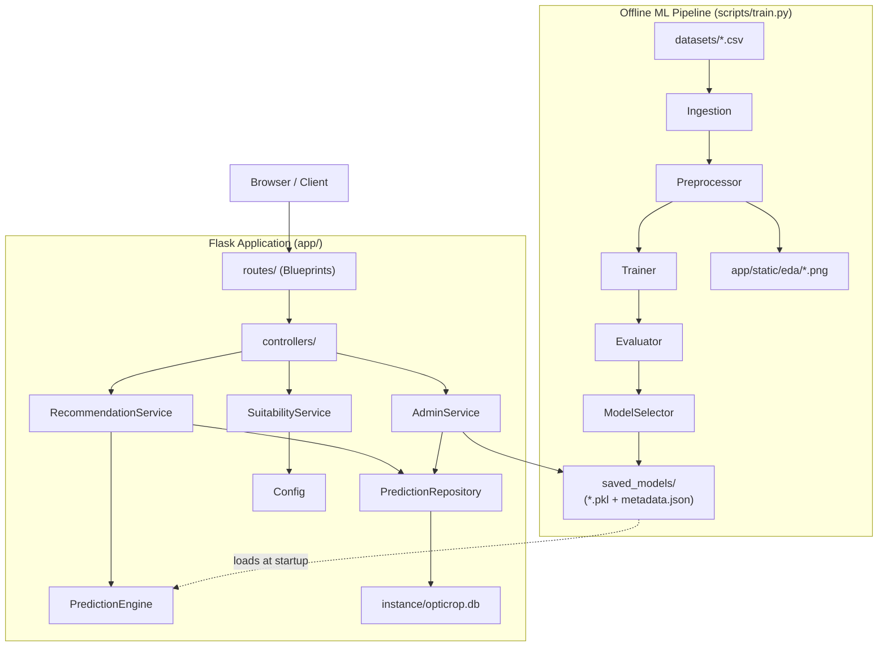
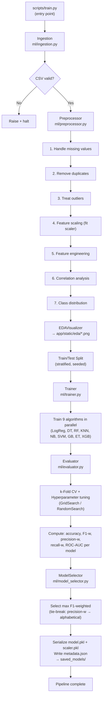
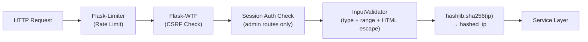

# Design Document — OptiCrop

## Overview

OptiCrop is a production-grade agricultural AI platform that predicts the optimal crop to cultivate based on soil chemistry and environmental inputs. The system follows a strict clean architecture: an offline ML pipeline produces serialized model artifacts, and a Flask web application loads those artifacts to serve predictions through a multi-page frontend. The two subsystems are decoupled — the ML pipeline runs as a standalone script and writes `.pkl` files and a JSON metadata file; the Flask app reads those artifacts at startup and never imports pipeline code.

### Design Goals

- **Separation of concerns**: Routes delegate to controllers/services; services delegate to repositories or the Prediction Engine; no cross-layer imports.
- **Offline training**: The ML pipeline is a `scripts/train.py` script entirely separate from the web application.
- **Pure inference**: `PredictionEngine` is a stateless class with no Flask or database dependencies.
- **Security by default**: CSRF on all state-changing routes, rate limiting on prediction endpoints, SHA-256 IP hashing, HTML-escaped string inputs.
- **Reproducible deployment**: Dockerfile + docker-compose with named volumes, Gunicorn WSGI server, env-var-driven config.

---

## Architecture

### Component Diagram



### Layer Definitions

| Layer | Location | Responsibility |
|---|---|---|
| Routes | `app/routes/` | HTTP request intake, CSRF/rate-limit enforcement, response serialization |
| Controllers | `app/controllers/` | Orchestrate request lifecycle: validate input, call service, format response |
| Services | `app/services/` | Business logic — recommendation, suitability analysis, admin operations |
| Repositories | `app/repositories/` | All SQLite access via `sqlite3`; no SQL outside this layer |
| ML Modules | `ml/` | Ingestion, preprocessing, training, evaluation, model selection, serialization |
| Prediction Engine | `app/ml/prediction_engine.py` | Load model artifact; pure `predict()` inference; no Flask/DB imports |
| Config | `app/config.py` | All settings from `os.environ`; `BaseConfig → DevelopmentConfig / ProductionConfig` |
| Templates | `app/templates/` | Jinja2 templates extending `base.html`; no business logic |
| Static | `app/static/` | CSS, JS bundles, EDA images |

### Layer Import Rules (enforced by architecture)

- Routes **may** import controllers.
- Controllers **may** import services, validators, and config.
- Services **may** import repositories, `PredictionEngine`, and config.
- Repositories **may** import config and `sqlite3` only.
- `PredictionEngine` **may** import `pickle`, `numpy`, `sklearn`, and config only.
- ML pipeline modules (`ml/`) **must not** import any `app/` module.
- `app/` modules **must not** import any `ml/` module.

---

## Components and Interfaces

### PredictionEngine

```python
class PredictionEngine:
    def __init__(self, model_path: str, scaler_path: str) -> None:
        """Load model and scaler from disk. Raises FileNotFoundError with path if missing."""

    def predict(self, input_vector: list[float]) -> PredictionResult:
        """Apply scaler, run inference. Returns PredictionResult.
        Raises ValueError if input_vector has wrong shape or non-numeric values."""
```

`PredictionResult` is a plain dataclass:

```python
@dataclass
class PredictionResult:
    predicted_label: str        # crop name string
    confidence_score: float     # in [0.0, 1.0]
```

### RecommendationService

```python
class RecommendationService:
    def __init__(self, engine: PredictionEngine, repo: PredictionRepository) -> None: ...

    def recommend(self, input_vector: InputVector, hashed_ip: str) -> PredictionResult:
        """Invoke engine, persist record, return result. Never calls SuitabilityService."""
```

### SuitabilityService

```python
class SuitabilityService:
    def __init__(self, config: BaseConfig) -> None: ...

    def evaluate(self, input_vector: InputVector) -> SuitabilityResult:
        """Apply threshold rules from config. Never invokes PredictionEngine or RecommendationService."""
```

`SuitabilityResult`:

```python
@dataclass
class SuitabilityResult:
    suitable: list[str]
    marginal: list[str]
    unsuitable: list[str]
```

### PredictionRepository

```python
class PredictionRepository:
    def __init__(self, db_path: str) -> None: ...

    def save(self, record: PredictionRecord) -> None:
        """Persist one record. Logs + raises on DB error."""

    def get_paginated(self, page: int, page_size: int) -> list[PredictionRecord]:
        """Return records ordered by timestamp DESC with LIMIT/OFFSET."""

    def count(self) -> int:
        """Return total record count as non-negative integer."""
```

### AdminService

```python
class AdminService:
    def get_model_metadata(self) -> ModelMetadata: ...
    def get_system_health(self) -> SystemHealth: ...
    def trigger_retraining(self) -> None:
        """Spawns threading.Thread running scripts/train.py subprocess. Never blocks."""
```

### ML Pipeline Modules

| Module | File | Responsibility |
|---|---|---|
| Ingestion | `ml/ingestion.py` | Read CSV from config path; validate non-empty |
| Preprocessor | `ml/preprocessor.py` | Missing values, dedup, outliers, scaling, correlation, class dist, EDA plots |
| Trainer | `ml/trainer.py` | Train 9 algorithms on training set |
| Evaluator | `ml/evaluator.py` | CV, hyperparameter tuning, metrics |
| ModelSelector | `ml/model_selector.py` | Select best by F1-weighted; serialize artifacts |
| EDAVisualizer | `ml/eda_visualizer.py` | Generate PNG plots to `app/static/eda/` |

---

## Full Module / File Map

```
opticrop/
├── app/
│   ├── __init__.py                   # Application factory: create_app()
│   ├── config.py                     # BaseConfig, DevelopmentConfig, ProductionConfig
│   ├── extensions.py                 # Flask-WTF CSRFProtect, Flask-Limiter init
│   ├── controllers/
│   │   ├── __init__.py
│   │   ├── recommendation_controller.py
│   │   ├── suitability_controller.py
│   │   ├── history_controller.py
│   │   ├── admin_controller.py
│   │   ├── dashboard_controller.py
│   │   └── analytics_controller.py
│   ├── routes/
│   │   ├── __init__.py
│   │   ├── main_routes.py            # /, /about, /contact, /research
│   │   ├── recommendation_routes.py  # /recommend
│   │   ├── suitability_routes.py     # /suitability
│   │   ├── history_routes.py         # /history, /api/history
│   │   ├── dashboard_routes.py       # /dashboard, /api/dashboard
│   │   ├── analytics_routes.py       # /analytics, /api/analytics
│   │   └── admin_routes.py           # /admin/*
│   ├── services/
│   │   ├── __init__.py
│   │   ├── recommendation_service.py
│   │   ├── suitability_service.py
│   │   ├── admin_service.py
│   │   ├── dashboard_service.py
│   │   └── analytics_service.py
│   ├── repositories/
│   │   ├── __init__.py
│   │   └── prediction_repository.py
│   ├── ml/
│   │   ├── __init__.py
│   │   └── prediction_engine.py      # Pure inference class; no Flask/DB imports
│   ├── models/
│   │   ├── __init__.py
│   │   ├── prediction_record.py      # PredictionRecord dataclass
│   │   ├── prediction_result.py      # PredictionResult dataclass
│   │   ├── input_vector.py           # InputVector dataclass + validation
│   │   ├── suitability_result.py     # SuitabilityResult dataclass
│   │   └── model_metadata.py         # ModelMetadata dataclass
│   ├── validators/
│   │   ├── __init__.py
│   │   └── input_validator.py        # Server-side field validation; HTML escaping
│   ├── utils/
│   │   ├── __init__.py
│   │   ├── hashing.py                # sha256_ip(ip: str) -> str
│   │   ├── logger.py                 # Structured logger factory
│   │   └── correlation_id.py         # generate_correlation_id() -> str
│   ├── static/
│   │   ├── css/
│   │   │   └── main.css              # Custom overrides; dark/light mode vars
│   │   ├── js/
│   │   │   ├── theme.js              # localStorage['opticrop-theme'] toggle
│   │   │   ├── validation.js         # Client-side field validation mirroring server
│   │   │   ├── charts.js             # Chart.js wrappers for all chart types
│   │   │   ├── dashboard.js          # Dashboard fetch + skeleton logic
│   │   │   ├── analytics.js          # Analytics fetch + chart render
│   │   │   └── loading.js            # Submit button disable + spinner
│   │   └── eda/                      # PNG files written by ML Pipeline at training
│   │       ├── correlation_heatmap.png
│   │       ├── class_distribution.png
│   │       └── feature_hist_<name>.png  # one per feature
│   └── templates/
│       ├── base.html                 # Bootstrap 5 layout; navbar; dark/light toggle
│       ├── index.html                # Home page
│       ├── about.html
│       ├── contact.html
│       ├── research.html
│       ├── recommend.html
│       ├── suitability.html
│       ├── history.html
│       ├── dashboard.html
│       ├── analytics.html
│       ├── admin/
│       │   ├── login.html
│       │   ├── dashboard.html        # Admin dashboard
│       │   └── logs.html
│       └── errors/
│           ├── 404.html
│           └── 500.html
├── ml/                               # Standalone ML pipeline modules
│   ├── __init__.py
│   ├── ingestion.py
│   ├── preprocessor.py
│   ├── trainer.py
│   ├── evaluator.py
│   ├── model_selector.py
│   └── eda_visualizer.py
├── scripts/
│   └── train.py                      # Entry point: runs full ML pipeline
├── tests/
│   ├── conftest.py                   # app fixture, in-memory SQLite, mock engine
│   ├── test_recommendation_routes.py
│   ├── test_suitability_routes.py
│   ├── test_history_routes.py
│   ├── test_admin_routes.py
│   ├── test_prediction_engine.py
│   ├── test_prediction_repository.py
│   ├── test_input_validator.py
│   ├── test_model_selector.py
│   ├── test_preprocessor.py
│   ├── test_recommendation_service.py
│   ├── test_suitability_service.py
│   └── property/
│       ├── conftest.py
│       ├── test_prop_prediction_engine.py
│       ├── test_prop_validation.py
│       ├── test_prop_repository.py
│       ├── test_prop_model_selector.py
│       └── test_prop_preprocessor.py
├── datasets/
│   └── crop_recommendation.csv
├── saved_models/
│   ├── <model_name>_<utc_ts>.pkl
│   ├── scaler_<utc_ts>.pkl
│   └── metadata.json
├── logs/
│   └── opticrop.log
├── instance/
│   └── opticrop.db
├── docs/
│   ├── installation.md
│   ├── architecture.md
│   ├── api.md
│   ├── deployment.md
│   └── docker.md
├── Dockerfile
├── docker-compose.yml
├── gunicorn.conf.py
├── requirements.txt
├── .env.example
├── .gitignore
└── README.md
```

---

## Data Models

### InputVector

```python
@dataclass
class InputVector:
    N: float            # Nitrogen [0, 140] kg/ha
    P: float            # Phosphorous [5, 145] kg/ha
    K: float            # Potassium [5, 205] kg/ha
    temperature: float  # [0, 50] °C
    humidity: float     # [0, 100] %
    rainfall: float     # [0, 300] mm
    ph: float           # [0, 14]

FIELD_RANGES: dict[str, tuple[float, float]] = {
    "N":           (0.0,   140.0),
    "P":           (5.0,   145.0),
    "K":           (5.0,   205.0),
    "temperature": (0.0,    50.0),
    "humidity":    (0.0,   100.0),
    "rainfall":    (0.0,   300.0),
    "ph":          (0.0,    14.0),
}
```

### PredictionResult

```python
@dataclass
class PredictionResult:
    predicted_label: str    # Crop name (member of training label set)
    confidence_score: float # [0.0, 1.0]
```

### PredictionRecord

```python
@dataclass
class PredictionRecord:
    id: int | None          # Auto-assigned by DB; None before insert
    timestamp: str          # UTC ISO 8601 (e.g. "2024-01-15T10:30:00Z")
    N: float
    P: float
    K: float
    temperature: float
    humidity: float
    rainfall: float
    ph: float
    predicted_crop: str
    confidence_score: float
    model_name: str
    hashed_ip: str          # SHA-256 hex digest; raw IP never stored
```

### ModelMetadata

```python
@dataclass
class ModelMetadata:
    model_name: str
    f1_weighted: float      # [0.0, 1.0]
    serialization_timestamp: str  # UTC ISO 8601
    model_path: str
    scaler_path: str
```

---

## API Endpoint Specifications

### POST `/api/recommend`

Invoke ML-based crop recommendation.

**Request body (JSON):**
```json
{
  "N": 90.0,
  "P": 42.0,
  "K": 43.0,
  "temperature": 20.8,
  "humidity": 82.0,
  "rainfall": 202.9,
  "ph": 6.5
}
```

**Success 200:**
```json
{
  "predicted_crop": "rice",
  "confidence_score": 0.953,
  "model_name": "RandomForest_2024-01-15T10:30:00Z"
}
```

**Error 400 (missing or invalid field):**
```json
{
  "error": "validation_error",
  "fields": {
    "N": "Field is required.",
    "ph": "Value 15.0 is outside valid range [0, 14]."
  }
}
```

**Error 429 (rate limit exceeded):**
```json
{ "error": "rate_limit_exceeded", "retry_after": 47 }
```

**Error 500:**
```json
{ "error": "internal_error", "correlation_id": "a3f9b2c1" }
```

---

### POST `/api/suitability`

Threshold-based suitability analysis for all crops.

**Request body:** Same structure as `/api/recommend`.

**Success 200:**
```json
{
  "suitable":   ["rice", "coconut"],
  "marginal":   ["maize", "banana"],
  "unsuitable": ["apple", "grapes"]
}
```

**Error 400 / 429 / 500:** Same schema as `/api/recommend`.

---

### GET `/api/history`

Paginated prediction history.

**Query params:** `page` (int, default 1), `page_size` (int, default 25, max 100).

**Success 200:**
```json
{
  "records": [
    {
      "id": 42,
      "timestamp": "2024-01-15T10:30:00Z",
      "N": 90.0, "P": 42.0, "K": 43.0,
      "temperature": 20.8, "humidity": 82.0,
      "rainfall": 202.9, "ph": 6.5,
      "predicted_crop": "rice",
      "confidence_score": 0.953,
      "model_name": "RandomForest_2024-01-15T10:30:00Z"
    }
  ],
  "total": 150,
  "page": 1,
  "page_size": 25
}
```

*Note: `hashed_ip` is never returned to the client.*

---

### GET `/api/dashboard`

Summary statistics for the Dashboard page.

**Success 200:**
```json
{
  "total_predictions": 1500,
  "most_recommended_crop": "rice",
  "avg_confidence": 0.872,
  "daily_counts": [
    { "date": "2024-01-15", "count": 42 }
  ]
}
```

---

### GET `/api/analytics`

Model comparison and trend data for the Analytics page.

**Success 200:**
```json
{
  "model_scores": [
    { "model": "RandomForest", "f1_weighted": 0.989 }
  ],
  "daily_volumes": [
    { "date": "2024-01-15", "count": 42 }
  ],
  "crop_distribution": [
    { "crop": "rice", "count": 210 }
  ]
}
```

---

### GET `/api/admin/metadata`

Active model metadata (admin only).

**Success 200:** `ModelMetadata` as JSON.

---

### POST `/api/admin/retrain`

Trigger background retraining (admin only).

**Success 202:**
```json
{ "status": "accepted", "message": "Retraining started in background." }
```

---

### GET `/api/health`

Health check for Docker/load balancer liveness probes.

**Success 200:**
```json
{ "status": "ok", "uptime_seconds": 3600 }
```

---

### Page Routes (HTML, served by Flask + Jinja2)

| Method | URL | Template |
|---|---|---|
| GET | `/` | `index.html` |
| GET | `/recommend` | `recommend.html` |
| GET | `/suitability` | `suitability.html` |
| GET | `/history` | `history.html` |
| GET | `/dashboard` | `dashboard.html` |
| GET | `/analytics` | `analytics.html` |
| GET | `/research` | `research.html` |
| GET | `/about` | `about.html` |
| GET | `/contact` | `contact.html` |
| GET | `/admin` | `admin/dashboard.html` |
| GET | `/admin/login` | `admin/login.html` |
| POST | `/admin/login` | Redirect to `/admin` on success |
| GET | `/admin/logout` | Redirect to `/` |

---

## ML Pipeline Flow



### Pipeline Configuration Interface

All pipeline settings are read from environment variables via `BaseConfig`. The script exits with a non-zero status if any required variable is absent.

---

## Database Schema

### SQLite table: `predictions`

```sql
CREATE TABLE IF NOT EXISTS predictions (
    id              INTEGER PRIMARY KEY AUTOINCREMENT,
    timestamp       TEXT    NOT NULL,  -- UTC ISO 8601
    N               REAL    NOT NULL,
    P               REAL    NOT NULL,
    K               REAL    NOT NULL,
    temperature     REAL    NOT NULL,
    humidity        REAL    NOT NULL,
    rainfall        REAL    NOT NULL,
    ph              REAL    NOT NULL,
    predicted_crop  TEXT    NOT NULL,
    confidence_score REAL   NOT NULL,
    model_name      TEXT    NOT NULL,
    hashed_ip       TEXT    NOT NULL   -- SHA-256 hex; raw IP never stored
);

CREATE INDEX IF NOT EXISTS idx_predictions_timestamp
    ON predictions (timestamp DESC);
```

Access is exclusively through `PredictionRepository` using `sqlite3` directly (no ORM). The repository creates the table on first connection if it does not exist. The database file path comes from `Config.DATABASE_PATH`.

---

## Security Design

### Security Layers



### CSRF Protection

- Library: `Flask-WTF` (`CSRFProtect`)
- Applied to all POST, PUT, PATCH, DELETE routes globally
- Every HTML form includes `{{ csrf_token() }}` as a hidden input
- AJAX requests must include `X-CSRFToken` header (populated from cookie by `theme.js`)
- Missing or invalid token → 403 response, request body not processed
- Secret sourced from `Config.CSRF_SECRET_KEY` (env var); absent at startup → halt

### Rate Limiting

- Library: `Flask-Limiter` with in-memory storage (production: configure Redis via `RATELIMIT_STORAGE_URL`)
- `/api/recommend`: limit from `Config.RECOMMEND_RATE_LIMIT` (e.g. `"20 per minute"`)
- `/api/suitability`: limit from `Config.SUITABILITY_RATE_LIMIT` (e.g. `"20 per minute"`)
- Exceeded → 429 with `Retry-After` header
- Window reset clears counter to zero

### IP Hashing

```python
# app/utils/hashing.py
import hashlib

def sha256_ip(raw_ip: str) -> str:
    return hashlib.sha256(raw_ip.encode()).hexdigest()
```

Raw IP is never written to the database or log files. `hashed_ip` is the only IP-derived value stored.

### Input Validation Flow

1. Controller receives JSON body or form data.
2. `InputValidator.validate(data)` checks:
   - All 7 fields present → else 400 with missing field names.
   - All values parseable as `float` → else 400 with non-numeric message.
   - All values within `FIELD_RANGES` → else 400 with field name and range.
3. All string fields are HTML-escaped with `html.escape()` before logging or storage.
4. Validated `InputVector` dataclass passed to service layer.

### Admin Authentication

- Session-based using Flask's built-in signed session cookie.
- `ADMIN_USERNAME` and `ADMIN_PASSWORD_HASH` (bcrypt) loaded from env.
- `@login_required` decorator on all admin routes redirects unauthenticated requests to `/admin/login` with 302.
- No OAuth required for this scope.

---

## Configuration Design

### Class Hierarchy

```python
# app/config.py
import os

class BaseConfig:
    # Flask core
    SECRET_KEY          = os.environ.get("SECRET_KEY")            # required
    CSRF_SECRET_KEY     = os.environ.get("CSRF_SECRET_KEY")       # required
    DEBUG               = False
    TESTING             = False

    # Database
    DATABASE_PATH       = os.environ.get("DATABASE_PATH",
                              "instance/opticrop.db")

    # ML / Model Registry
    MODEL_REGISTRY_PATH = os.environ.get("MODEL_REGISTRY_PATH",
                              "saved_models/")
    ACTIVE_MODEL_PATH   = os.environ.get("ACTIVE_MODEL_PATH")     # required
    ACTIVE_SCALER_PATH  = os.environ.get("ACTIVE_SCALER_PATH")    # required
    DATASET_PATH        = os.environ.get("DATASET_PATH")          # required (pipeline)

    # Preprocessing
    MISSING_VALUE_STRATEGY  = os.environ.get("MISSING_VALUE_STRATEGY", "drop")
    OUTLIER_STRATEGY        = os.environ.get("OUTLIER_STRATEGY", "iqr_clip")
    SCALER_TYPE             = os.environ.get("SCALER_TYPE", "standard")
    TEST_RATIO              = float(os.environ.get("TEST_RATIO", "0.2"))
    RANDOM_SEED             = int(os.environ.get("RANDOM_SEED", "42"))
    CV_FOLDS                = int(os.environ.get("CV_FOLDS", "5"))
    HYPERPARAM_STRATEGY     = os.environ.get("HYPERPARAM_STRATEGY", "grid")

    # Rate limiting
    RECOMMEND_RATE_LIMIT    = os.environ.get("RECOMMEND_RATE_LIMIT",  "20 per minute")
    SUITABILITY_RATE_LIMIT  = os.environ.get("SUITABILITY_RATE_LIMIT","20 per minute")
    RATELIMIT_STORAGE_URL   = os.environ.get("RATELIMIT_STORAGE_URL", "memory://")

    # Logging
    LOG_PATH                = os.environ.get("LOG_PATH", "logs/opticrop.log")
    LOG_LEVEL               = os.environ.get("LOG_LEVEL", "INFO")

    # Server
    GUNICORN_WORKERS        = int(os.environ.get("GUNICORN_WORKERS", "4"))

    # Admin
    ADMIN_USERNAME          = os.environ.get("ADMIN_USERNAME")    # required
    ADMIN_PASSWORD_HASH     = os.environ.get("ADMIN_PASSWORD_HASH") # required

    # Frontend
    CHARTJS_URL             = os.environ.get(
        "CHARTJS_URL",
        "https://cdn.jsdelivr.net/npm/chart.js"
    )

    # EDA static dir
    EDA_STATIC_DIR          = os.environ.get("EDA_STATIC_DIR",
                                  "app/static/eda/")

    # Suitability thresholds (JSON string from env, parsed at runtime)
    SUITABILITY_THRESHOLDS  = os.environ.get("SUITABILITY_THRESHOLDS") # required

class DevelopmentConfig(BaseConfig):
    DEBUG = True

class ProductionConfig(BaseConfig):
    DEBUG = False
```

### Environment Variable Reference (`.env.example`)

```ini
# --- Required ---
SECRET_KEY=change_me_in_production
CSRF_SECRET_KEY=change_me_csrf_secret
ACTIVE_MODEL_PATH=saved_models/model_latest.pkl
ACTIVE_SCALER_PATH=saved_models/scaler_latest.pkl
DATASET_PATH=datasets/crop_recommendation.csv
ADMIN_USERNAME=admin
ADMIN_PASSWORD_HASH=<bcrypt_hash>
SUITABILITY_THRESHOLDS=<json_string>

# --- Optional (defaults shown) ---
DATABASE_PATH=instance/opticrop.db
MODEL_REGISTRY_PATH=saved_models/
MISSING_VALUE_STRATEGY=drop
OUTLIER_STRATEGY=iqr_clip
SCALER_TYPE=standard
TEST_RATIO=0.2
RANDOM_SEED=42
CV_FOLDS=5
HYPERPARAM_STRATEGY=grid
RECOMMEND_RATE_LIMIT=20 per minute
SUITABILITY_RATE_LIMIT=20 per minute
RATELIMIT_STORAGE_URL=memory://
LOG_PATH=logs/opticrop.log
LOG_LEVEL=INFO
GUNICORN_WORKERS=4
EDA_STATIC_DIR=app/static/eda/
CHARTJS_URL=https://cdn.jsdelivr.net/npm/chart.js
FLASK_ENV=production
```

Config selection: `FLASK_ENV=development` → `DevelopmentConfig`; `FLASK_ENV=production` or absent → `ProductionConfig` (with warning logged).

---

## Frontend Component Map

### Templates

| Template | Extends | Description |
|---|---|---|
| `base.html` | — | Bootstrap 5 layout, navbar, dark/light toggle, Bootstrap Icons CDN |
| `index.html` | `base.html` | Hero section, feature highlights, CTA button |
| `recommend.html` | `base.html` | 7-field form, loading spinner, result panel, error display |
| `suitability.html` | `base.html` | 7-field form, tiered results (suitable/marginal/unsuitable) |
| `history.html` | `base.html` | Paginated table, empty state, loading indicator |
| `dashboard.html` | `base.html` | KPI widgets with skeleton loaders, activity chart |
| `analytics.html` | `base.html` | Model comparison bar chart, daily volume line chart, crop pie chart |
| `research.html` | `base.html` | EDA images (correlation heatmap, histograms, class dist), dataset stats |
| `about.html` | `base.html` | Platform description, ML methodology, tech stack |
| `contact.html` | `base.html` | Name/email/message form with client-side validation |
| `admin/login.html` | `base.html` | Login form |
| `admin/dashboard.html` | `base.html` | Active model info, retrain trigger, system health, paginated logs |
| `errors/404.html` | `base.html` | Not found message + Home link |
| `errors/500.html` | `base.html` | Server error + correlation ID + Home link |

### JavaScript Modules

| File | Responsibility |
|---|---|
| `theme.js` | Read/write `localStorage['opticrop-theme']`; apply `data-bs-theme` attribute; toggle control handler |
| `validation.js` | Mirror server-side range validation; block form submit; display inline errors |
| `charts.js` | Chart.js wrappers: `renderBarChart()`, `renderLineChart()`, `renderPieChart()` |
| `dashboard.js` | Fetch `/api/dashboard`; populate KPI cards; render activity chart; skeleton → data/error |
| `analytics.js` | Fetch `/api/analytics`; render model comparison, volume, and distribution charts |
| `loading.js` | `showLoading(btn, form)` / `hideLoading(btn, form)` utility used by all form pages |

### Dark / Light Mode

- Toggle control in `base.html` navbar sets `document.documentElement.setAttribute('data-bs-theme', mode)`.
- `theme.js` reads `localStorage['opticrop-theme']` on DOM load; defaults to `'light'` if absent.
- Toggle handler updates `localStorage` and applies new mode immediately without page reload.
- Bootstrap 5 `data-bs-theme` attribute controls all component colors natively.

---

## Correctness Properties

*A property is a characteristic or behavior that should hold true across all valid executions of a system — essentially, a formal statement about what the system should do. Properties serve as the bridge between human-readable specifications and machine-verifiable correctness guarantees.*

---

### Property 1: Missing Value Handling Completeness

*For any* DataFrame containing N rows with missing values, after the Preprocessor applies the configured missing-value strategy, the resulting DataFrame SHALL contain zero missing values (if strategy is "drop") or exactly the same count of rows with all values filled (if strategy is "impute"), and the logged count SHALL equal N.

**Validates: Requirements 2.2**

---

### Property 2: Duplicate Row Removal Count Correctness

*For any* DataFrame containing D exact-duplicate rows (where a duplicate is defined as a row identical across all columns to a previously seen row), after deduplication the resulting DataFrame SHALL have exactly `original_count - D` rows, and the logged count SHALL equal D.

**Validates: Requirements 2.3**

---

### Property 3: Class Distribution Counts Sum to Total Rows

*For any* DataFrame with a target label column, the per-class counts returned and logged by the Preprocessor SHALL sum to the total number of rows in the DataFrame.

**Validates: Requirements 2.7**

---

### Property 4: Train/Test Split Proportionality and Class Preservation

*For any* Dataset of size N and configured test ratio r ∈ (0.0, 1.0), after stratified splitting:
- The test set SHALL contain `floor(N * r)` rows (±1 due to integer rounding).
- The training set SHALL contain the remaining rows.
- The relative frequency of each class in the test set SHALL be within 5% of its relative frequency in the full Dataset.

**Validates: Requirements 3.1, 3.3**

---

### Property 5: Split Determinism Under the Same Seed

*For any* Dataset and any random seed s ∈ [0, 2³²−1], calling the train/test split twice with the same seed SHALL produce identical training sets and identical test sets (element-wise equality).

**Validates: Requirements 3.4**

---

### Property 6: Model Selection Picks Valid Max-F1 Model with Tie-Breaking

*For any* evaluation report containing one or more models with valid F1_Weighted scores, the ModelSelector SHALL select a model m such that:
- m.f1_weighted ≥ f1_weighted for all other valid models in the report.
- If two or more models share the maximum F1_Weighted, the one with the highest precision_weighted is selected.
- If precision_weighted also ties, the alphabetically first model name is selected.
- Models with missing or invalid F1_Weighted scores are excluded from consideration.

**Validates: Requirements 6.1, 6.2, 6.6**

---

### Property 7: Prediction Engine Result Structure Validity

*For any* valid InputVector (all 7 fields within their defined ranges), the PredictionEngine.predict() method SHALL return a PredictionResult where:
- `predicted_label` is a non-empty string.
- `confidence_score` is a float in the closed interval [0.0, 1.0].

**Validates: Requirements 8.4**

---

### Property 8: Valid Input Vector Returns Valid Prediction Response

*For any* valid InputVector submitted via POST to `/api/recommend`, the Flask application SHALL return an HTTP 200 response whose JSON body contains:
- `predicted_crop`: a non-empty string.
- `confidence_score`: a float in [0.0, 1.0].
- `model_name`: a non-empty string.

**Validates: Requirements 10.1**

---

### Property 9: Missing Field Returns 400 with Correct Field-Level Error

*For any* subset of the 7 required InputVector fields that is omitted from the request body to `/api/recommend` or `/api/suitability`, the Flask application SHALL return an HTTP 400 response whose JSON body's `fields` object contains an entry for each and only each missing field.

**Validates: Requirements 10.3**

---

### Property 10: Out-of-Range Field Returns 400 with Field and Range Information

*For any* InputVector where one or more fields contain a value outside its defined valid range, submitting that vector to `/api/recommend` or `/api/suitability` SHALL return an HTTP 400 response whose JSON body's `fields` object identifies each offending field by name and includes its valid range.

**Validates: Requirements 10.4**

---

### Property 11: Prediction Record Persisted with All Input Fields

*For any* valid InputVector that produces a successful prediction via `/api/recommend`, querying the PredictionRepository after the request completes SHALL return a record whose N, P, K, temperature, humidity, rainfall, ph, predicted_crop, and confidence_score fields exactly match the submitted InputVector and the returned PredictionResult.

**Validates: Requirements 10.5**

---

### Property 12: Every Crop Appears in Exactly One Suitability Tier

*For any* valid InputVector submitted to the SuitabilityService, the union of `suitable ∪ marginal ∪ unsuitable` in the returned SuitabilityResult SHALL equal the full set of crops defined in Config, and the three lists SHALL be pairwise disjoint (no crop appears in more than one tier).

**Validates: Requirements 11.1**

---

### Property 13: Paginated Records Ordered by Timestamp Descending

*For any* set of PredictionRecords inserted with distinct timestamps, calling `get_paginated(page, page_size)` for any valid page number SHALL return records ordered by `timestamp DESC` — i.e., for any two adjacent records in the result, the earlier record's timestamp SHALL be ≤ the later record's timestamp in descending order.

**Validates: Requirements 12.4**

---

### Property 14: Count Equals Actual Persisted Record Count

*For any* sequence of `save()` calls on the PredictionRepository, `count()` SHALL return a non-negative integer equal to the number of successfully persisted records.

**Validates: Requirements 12.5**

---

### Property 15: Predicted Label Belongs to Training Label Set

*For any* valid InputVector sampled across the full valid range of each field, the `predicted_label` returned by the PredictionEngine SHALL be a member of the set of crop labels present in the training Dataset used to train the loaded model.

**Validates: Requirements 28.7**

---

### Property 16: Scaler Round-Trip Preserves Input Values

*For any* valid InputVector, applying the fitted StandardScaler to transform the vector and then applying the inverse transform SHALL produce values within 1×10⁻⁶ absolute tolerance of the original input values for all 7 fields.

**Validates: Requirements 28.8**

---

## Error Handling

### Error Categories and Responses

| Error Condition | HTTP Status | Response |
|---|---|---|
| Missing InputVector field | 400 | `{"error": "validation_error", "fields": {"<field>": "..."}}` |
| Non-numeric field value | 400 | Field-level error with field name |
| Out-of-range field value | 400 | Field-level error with field and valid range |
| Missing/invalid CSRF token | 403 | `{"error": "csrf_validation_failed"}` |
| Rate limit exceeded | 429 | `{"error": "rate_limit_exceeded", "retry_after": N}` |
| PredictionEngine inference error | 500 | `{"error": "internal_error", "correlation_id": "..."}` |
| PredictionRepository write failure | 500 | Same as above; ERROR log |
| Unhandled exception | 500 | `{"error": "internal_error", "correlation_id": "..."}` |
| Route not found | 404 | HTML 404 page |

### Global Exception Handler

Registered in `app/__init__.py`:
```python
@app.errorhandler(Exception)
def handle_exception(e):
    correlation_id = generate_correlation_id()
    logger.error("Unhandled exception [%s]: %s", correlation_id, traceback.format_exc())
    return render_template("errors/500.html", correlation_id=correlation_id), 500
```

Stack traces, file paths, env var values, and DB details are never included in client responses.

### ML Pipeline Error Handling

- Missing config key → `ConfigurationError` with key name; exit code 1.
- File not found → `DataIngestionError` with path; exit code 1.
- Parse error → `DataParseError` distinct from `DataIngestionError`; exit code 1.
- Individual algorithm training failure → log error + skip; continue training remaining algorithms.
- Serialization I/O error → log + re-raise; exit code 1.

---

## Testing Strategy

### Overview

The test suite uses **Pytest** with a dual approach: example-based unit/integration tests for concrete scenarios and property-based tests for universal behavioral properties.

### Test Categories

| Category | Location | Description |
|---|---|---|
| Route tests | `tests/test_*_routes.py` | HTTP status codes and JSON shapes; mock PredictionEngine |
| Service tests | `tests/test_*_service.py` | Business logic in isolation; mock repositories |
| Repository tests | `tests/test_prediction_repository.py` | In-memory SQLite; real repository logic |
| Validation tests | `tests/test_input_validator.py` | All missing/non-numeric/out-of-range cases |
| Engine tests | `tests/test_prediction_engine.py` | Mocked pickle artifacts; shape/type checking |
| Model selector tests | `tests/test_model_selector.py` | F1 selection, tie-breaking, error cases |
| Preprocessor tests | `tests/test_preprocessor.py` | Step ordering, dedup, outliers, scaling |
| Property tests | `tests/property/test_prop_*.py` | Universal properties (see below) |

### Test Fixtures (`tests/conftest.py`)

```python
@pytest.fixture
def app():
    """Flask app with TestingConfig, in-memory SQLite."""
    app = create_app(TestingConfig)
    with app.app_context():
        init_db(app)   # creates tables in :memory:
        yield app

@pytest.fixture
def client(app):
    return app.test_client()

@pytest.fixture
def mock_engine():
    """unittest.mock.patch on PredictionEngine.predict()."""
    with patch("app.services.recommendation_service.PredictionEngine") as m:
        instance = m.return_value
        instance.predict.return_value = PredictionResult(
            predicted_label="rice", confidence_score=0.95
        )
        yield instance
```

### Property-Based Testing

**Library**: `Hypothesis` (Python)

**Minimum iterations**: 100 per property test (configured via `@settings(max_examples=100)`)

**Tag format**: Each property test is tagged with a comment:
```python
# Feature: opticrop, Property N: <property_text>
```

#### Property Test Implementations

**`tests/property/test_prop_preprocessor.py`**
```python
# Feature: opticrop, Property 1: Missing value handling completeness
@given(df=dataframes_with_missing_values())
@settings(max_examples=100)
def test_missing_value_handling_completeness(df): ...

# Feature: opticrop, Property 2: Duplicate removal count correctness
@given(df=dataframes_with_duplicates())
@settings(max_examples=100)
def test_duplicate_removal_count_correctness(df): ...

# Feature: opticrop, Property 3: Class distribution sums to total rows
@given(df=arbitrary_labeled_dataframes())
@settings(max_examples=100)
def test_class_distribution_sums_to_total(df): ...
```

**`tests/property/test_prop_split.py`**
```python
# Feature: opticrop, Property 4: Train/test split proportionality
@given(dataset=crop_dataframes(), ratio=st.floats(min_value=0.01, max_value=0.49))
@settings(max_examples=100)
def test_split_proportionality_and_stratification(dataset, ratio): ...

# Feature: opticrop, Property 5: Split determinism under same seed
@given(dataset=crop_dataframes(), seed=st.integers(min_value=0, max_value=2**32 - 1))
@settings(max_examples=100)
def test_split_determinism(dataset, seed): ...
```

**`tests/property/test_prop_model_selector.py`**
```python
# Feature: opticrop, Property 6: Model selection picks max-F1 with tie-breaking
@given(report=evaluation_reports())
@settings(max_examples=100)
def test_model_selection_picks_max_f1_with_tiebreak(report): ...
```

**`tests/property/test_prop_prediction_engine.py`**
```python
# Feature: opticrop, Property 7: Prediction engine result structure validity
@given(input_vec=valid_input_vectors())
@settings(max_examples=100)
def test_prediction_result_structure(input_vec): ...

# Feature: opticrop, Property 15: Predicted label belongs to training label set
@given(input_vec=valid_input_vectors())
@settings(max_examples=100)
def test_predicted_label_in_training_set(input_vec): ...

# Feature: opticrop, Property 16: Scaler round-trip preserves input values
@given(input_vec=valid_input_vectors())
@settings(max_examples=100)
def test_scaler_roundtrip(input_vec): ...
```

**`tests/property/test_prop_validation.py`**
```python
# Feature: opticrop, Property 8: Valid input returns valid prediction response
@given(input_vec=valid_input_vectors())
@settings(max_examples=100)
def test_valid_input_returns_200(client, mock_engine, input_vec): ...

# Feature: opticrop, Property 9: Missing field returns 400 with field-level error
@given(missing_fields=st.sets(st.sampled_from(INPUT_FIELD_NAMES), min_size=1))
@settings(max_examples=100)
def test_missing_field_returns_400(client, missing_fields): ...

# Feature: opticrop, Property 10: Out-of-range field returns 400 with field and range
@given(field_name=st.sampled_from(INPUT_FIELD_NAMES),
       value=out_of_range_value_for_field())
@settings(max_examples=100)
def test_out_of_range_returns_400(client, field_name, value): ...
```

**`tests/property/test_prop_repository.py`**
```python
# Feature: opticrop, Property 11: Prediction record persisted with all input fields
@given(record=prediction_records())
@settings(max_examples=100)
def test_record_persisted_with_all_fields(record): ...

# Feature: opticrop, Property 12: Every crop in exactly one suitability tier
@given(input_vec=valid_input_vectors())
@settings(max_examples=100)
def test_suitability_tiers_partition_all_crops(input_vec): ...

# Feature: opticrop, Property 13: Paginated records ordered by timestamp descending
@given(records=st.lists(prediction_records(), min_size=1, max_size=50))
@settings(max_examples=100)
def test_paginated_records_ordered_desc(records): ...

# Feature: opticrop, Property 14: Count equals persisted record count
@given(records=st.lists(prediction_records(), min_size=0, max_size=50))
@settings(max_examples=100)
def test_count_equals_persisted_records(records): ...
```

### Coverage Target

Branch coverage across all production source modules ≥ 80% (`pytest --cov=app --cov=ml --cov-report=term-missing`).

---

## Deployment Architecture

### Dockerfile

```dockerfile
FROM python:3.11-slim

WORKDIR /app

# Install dependencies first (layer caching)
COPY requirements.txt .
RUN pip install --no-cache-dir -r requirements.txt

# Copy application source
COPY . .

# Create runtime directories
RUN mkdir -p logs instance saved_models datasets app/static/eda

EXPOSE 5000

CMD ["gunicorn", "--config", "gunicorn.conf.py", "app:create_app()"]
```

### docker-compose.yml

```yaml
version: "3.9"
services:
  web:
    build: .
    ports:
      - "5000:5000"
    env_file:
      - .env
    volumes:
      - datasets_vol:/app/datasets
      - models_vol:/app/saved_models
      - logs_vol:/app/logs
      - db_vol:/app/instance
    healthcheck:
      test: ["CMD", "curl", "-f", "http://localhost:5000/api/health"]
      interval: 10s
      timeout: 5s
      retries: 3
      start_period: 15s

volumes:
  datasets_vol:
  models_vol:
  logs_vol:
  db_vol:
```

### Gunicorn Configuration (`gunicorn.conf.py`)

```python
import os

bind    = "0.0.0.0:5000"
workers = min(int(os.environ.get("GUNICORN_WORKERS", "4")), 8)
timeout = 120
loglevel = os.environ.get("LOG_LEVEL", "info").lower()
accesslog = "-"   # stdout
errorlog  = "-"   # stdout
```

### Environment Selection

| `FLASK_ENV` | Config class | Gunicorn debug |
|---|---|---|
| `development` | `DevelopmentConfig` | Off |
| `production` | `ProductionConfig` | Off |
| absent | `ProductionConfig` | Off (+ WARNING logged) |

### Admin Retraining (Background Task)

The Admin Dashboard triggers retraining without Celery:

```python
# app/services/admin_service.py
import threading
import subprocess

def trigger_retraining(self) -> None:
    def run():
        result = subprocess.run(
            ["python", "scripts/train.py"],
            capture_output=True, text=True
        )
        if result.returncode != 0:
            logger.error("Retraining failed: %s", result.stderr)
        else:
            logger.info("Retraining completed successfully.")
    t = threading.Thread(target=run, daemon=True)
    t.start()
```

Status is polled by the frontend via a `/api/admin/retrain/status` endpoint that reads a lightweight status file written by `scripts/train.py`.

### Health Check

`GET /api/health` always returns `{"status": "ok"}` with HTTP 200, even when no model is loaded (startup warning only). Used by Docker Compose healthcheck and load balancer liveness probes.
